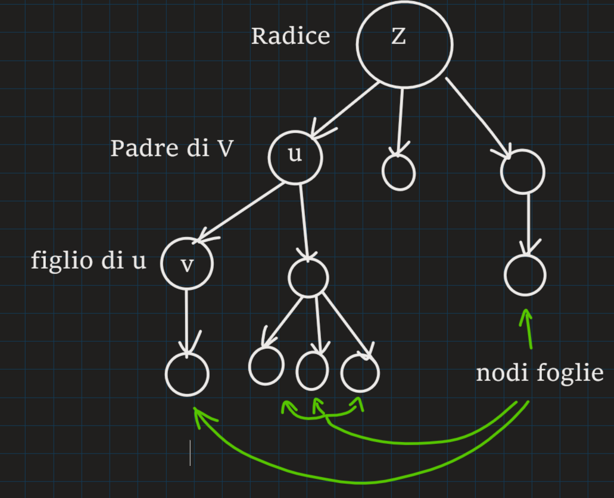

# Trees (alberi)

strutture dati gerarchiche

- cartelle e sottocartelle
- menù a tendina
- ...
  
## Alcune proprietà

- nodi
- archi (padre-figlio)
- n archi uscenti :
  - se n(max) fissato -> albero n_ario
  - altrimenti -> albero generico
- livello di un nodo
- profondità di un albero (lvl max)



Un albero è nullo se non ha nodi

un nodo si dice foglia quando non ha figli

due nodi si dicono fratelli se hanno lo stesso padre

ciascun nodo ha un **livello**, iniziando dalla radice che è lvl 1 e incrementando da padre a figlio

Alberi particolari:

Albero binario (n = 2)

Albero degenere (ogni nodo ha solamente un figlio)

## Alberi binari

### Se la profondità di un albero binario è k

numero min nodi: *k*  
numero max nodi: *2^k -1*

### se si hanno n nodi

profondità min: *O(log(n))*  
profondità max: *O(n)*

### Casi particolari

Albero completo (ogni livello tranne l'ultimo ha n figli)

Albero Bilanciato (per ogni nodo *n* |Pns - Pnd| <= 1)
cioè: la differenza di profondità tra il ramo sinistro e destro non è mai superiore a 1 per ogni nodo dell'albero

## Rappresentazioni

### indicizzate

#### Vettore dei Padri

ogni nodo contiene (info, parent index)

| Nodo         | ... | B   | D   | ... | C   | ... | A   | ... | E   |
| ------------ | --- | --- | --- | --- | --- | --- | --- | --- | --- |
| parent index | ... | 9   | 9   | ... | 9   | ... | -1  | ... | 7   |
| index        | ... | 3   | 4   | ... | 7   | 8   | 9   | ... | 13  |

```text
A
├──B
├──C
│  └──E
└──D
```

Binario

### Vettore posizionale

#### Alberi d-ari

dato un nodo v `P[d*v+i]    i in [0, d-1]`
`P[2*2 + 0] = P[4]`

| Nodo  | .   | A   | B   | C   | D   | .   | .   | E   | ... |
| ----- | --- | --- | --- | --- | --- | --- | --- | --- | --- |
| index | 0   | 1   | 2   | 3   | 4   | 5   | 6   | 7   | ... |

```text
A--+
|  |
B  C
|  |
D  E
```

Accesso ai figlio in *O(1)*

Accesso al Padre in *O(1)*  
`int(V/d)` V: nodo di cui voglio il padre

dato K prof. max prevedi spazio der un albero **PIENO** di prof. K

## collegate

## puntatori ai figli

ogni nodo ha informazioni su se stesso e **n** puntatori che puntano ai figli

permette di gestire alberi n-ari

```text
.
|
A------+
|      |
B---+  C--+
|   |  |  |
D-+ 0  0  E-+
| |       | |
0 0       0 0

0 = null
```

[una possibile implementazione per alberi binari](../../Implementazioni/AlberoB/AlberoB.h)

permette di essere convertito in altri tipi di strutture, per velocizzare alcune funzioni come la ricerca

## liste di puntatori ai figli

permette di gestire Alberi generici non avendo limitazioni su quanti figli un nodo può avere

## Primo figlio-fratello

ogni Nodo tiene conto del primo figlio e del primo fratello

```text
.
|
A->0
|  
B---->C->0
|     |
D->0  E->0
|     |
0     0

0 = null
```
