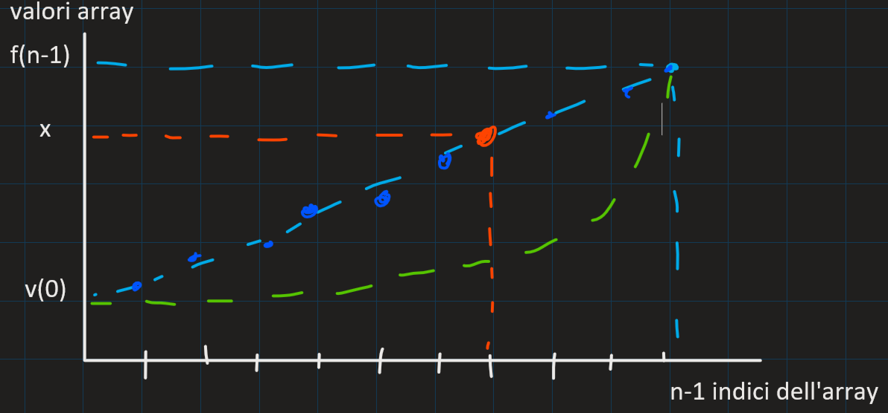

<!-- Il latino non serve
 Ma cesare disse Divide et Impera, per governare un impero
 tanto grande quanto l'impero Romano
-->

# Tecnica divide et Impera

1) devo poter dividere P in sotto-problemI
2) devo poter combinare le sotto-soluzioni

## pseudocodice

```text
Tsoluzione DivideEtImpera(count TproblemaP){
	se dimensione di p <= dimensione minima:
		risolvi direttamente
	altrimenti:
		k <--- numeroSottoproblemi(P)
		P = [P1...Pk] <--- individua sottoproblemi (P, K)
		per ogni Pi in P
			Si <--- DividiEtImpera(Pi) 
		CombinaSoluzioni({S1...Sk}, S)
		return S

}
```

### esempio

```cpp
bool ricercaBinariaRic(int v[], int x, int n, int left, int right) {
    if (left >= right) // risolvi direttamente
        return (left == right && v[left] == x);
    else {  //individua sottoproblemi
        int mid = (left + right) / 2;

        if (v[mid] < x)
            left = mid + 1;
        else if (v[mid] > x)
            right = mid - 1;
        else  // v[medio] == x
            left = right = mid;
        return ricercaBinariaRic(v[], x, n, left, right);
    }
}
```

___

## stima lineare

distribuzione uniforme:  
`int m = int (fin-in)*(x-v[in])/(v[fin] - v[in])`

🟦 distribuzione uniforme (lineare)  
🟩 distribuzione esponenziale


  
funziona molto bene quando **conosciamo l'andamento** dei valori contenuti nella lista

Ricerca Uniforme $O(n)$ C.P.
