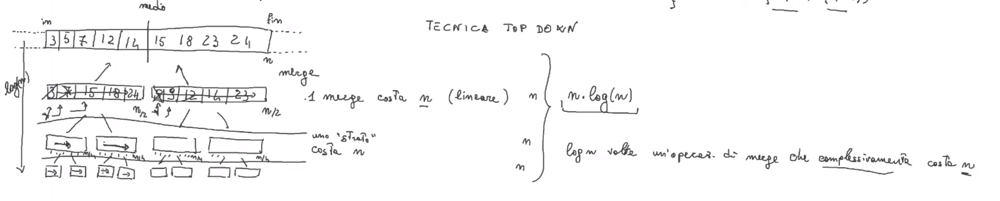

# alcune note su divide et impera

questo è un procecsso ricorsivo

- scomposizione
- soluzione di sottoproblemi
- ricomposizione

```cpp
int fib(int n){
    ... 
	return fib(n - 1) + fib(n - 2);
}
```

è una tecnica di Top-Down  
nel senso che parte dal problema più grande e va a scomporli in problemi più semplici

## Merge Sort



```cpp
void mergeSort(int v[], int in, int fin){
	if ((fin-in) < 20) insertionSort(V, in, fin);
	else{
		int medio = (in+fin) / 2;

		//scomposizione dei sottoproblemi
		mergeSort(v, in, medio);
		mergeSort(v, medio + 1, fin);

		//ricomposizione dei sottoproblemi
		merge(v, in, fin, medio);
	}
}

void merge(int v[], int in, int fin, int medio){
	int a[fin-in];
	int i1 = in, i2 = medio +1;
	int i3 = 0;

	while(i1 <= medio && i2 <= fin){
		if(v[i1]) < V[i2])
			a[i3++] = v[i1++]		
		else
			a[i3++] = v[i2++]
		
	}
	//se rimangono "residui" a sinistra
	while(i1 <= medio)
		a[i3++] = v[i1++]
	
	//se rimangono "residui" a destra
	while(i2 <= fin)
		a[i3++] = v[i2++]

	for(i3 = 0, i1 = in; i1 <= fin; i3++, i1+){
		v[i1] = a[i3];
	}

}

```
