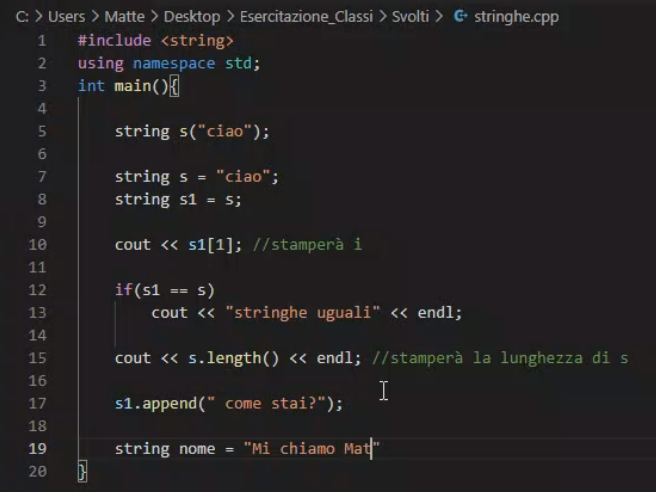

# Stringhe



```cpp

#include <string>
using namespace std;

string s("ciao"); // chiama il costruttore normale

string s = "ciao"; 

string s1 = s; // chiama il costruttore di copia

cout << s1[1] //stamperà 'i'

if(s1 == s)
	cout << "stringhe uguali" << endl;

cout << s.lenght() << endl; // stamperà la lunghezza di s

s1.append(" come stai?");

string nome = "Mi chiamo Matteo"

```
