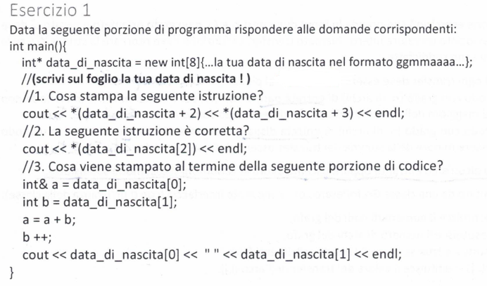
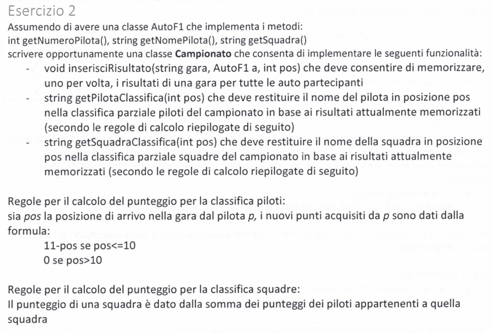
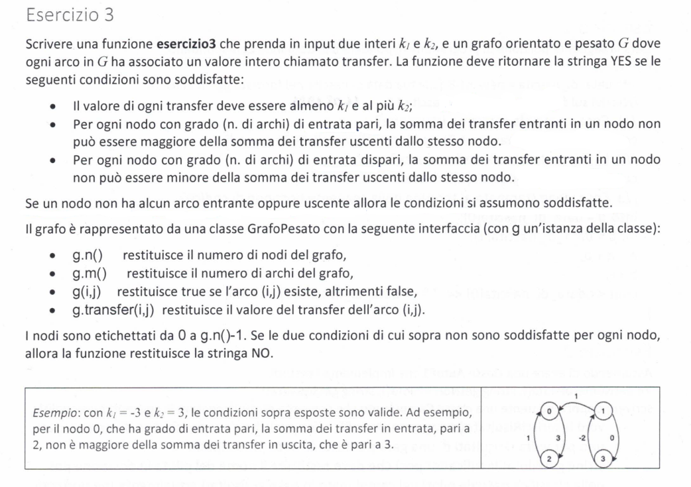
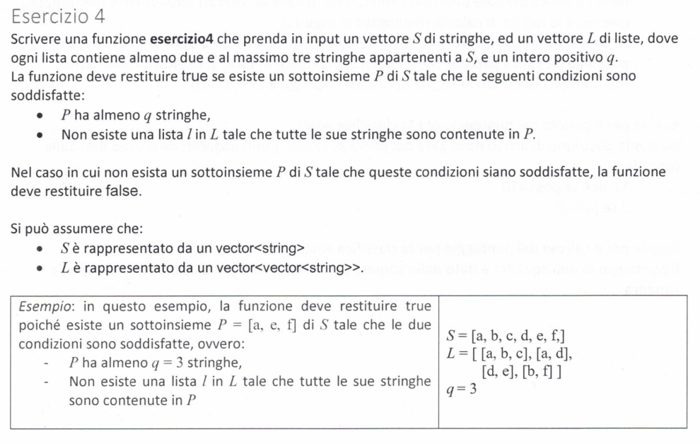

# Simulazione

___

## Esercizio 1



```cpp
int main(){
	int* data_di_nascita = new int[8] {2,3,0,4,1,9,9,8}; // data presa a caso
	
	// 1.
	// D: cosa stampa la seguente istruzione?
	cout << *(data_di_nascita + 2) << *(data_di_nascita + 3) << endl;
	// R: stamperà le due cifre che compongono il mese nella data di nascita
	// nel nostro caso "04"

	
	// 2.
	// D: la seguente istruzione è corretta?
	cout << *(data_di_nascita[2]) << endl;
	// R: No, data_di_nascita[2] è un valore ma lo stiamo trattando come fosse un indirizzo
	// questa istruzione non è corretta 


	// 3.
	// D: Cosa viene stampato al termine nella seguente porzione di codice?
	int& a = data_di_nascita[0];
	int b = data_di_nascita[1];

	a = a+b;
	b++;
	cout << data_di_nascita[0] << " " << data_di_nascita[1]<< endl;
	// R: la var. a è un riferimento al primo elemento di data_di_nascita, mentre b è una semplice copia
	// quando andiamo a cambiare il valore di a, questo cambiamento è riportato anche all'interno dell'array
	// mentre al cambiare di b l'array rimane invariato
	// quindi nel nostro caso
	// data_di_nascita[0] = a = 2 + 3 = 5 
	// e quindi verrà stampato "5 3"
}

```

___

## Esercizio 2



```cpp
#include <string>
#include <vector>
#include <pair>

class Campionato {
	vector<pair<int, string>> classifica_piloti;
	vector<pair<int, string>> classifica_squadre;


public:
	void inserisci_risultato(string gara, AutoF1& a, int pos) {
		int punti = pos > 10 ? 0 : 11 - pos;


		bool presente = false;
		for(int i = 0; i < classifica_piloti.size() && !presente; i++) {
			if(classifica_piloti[i].second == a.getNomePilota()) {
				classifica_piloti[i].first += punti;
				presente = true;
			}
		}
		if(!presente)
			classifica_piloti.emplace_back(punti, a.getNomePilota());

		presente = false;
		for(int i = 0; i < classifica_squadre.size() && !presente; i++) {
			if(classifica_squadre[i].second == a.getSquadra()) {
				classifica_squadre[i].first += punti;
				presente = true;
			}
		}
		if(!presente)
			classifica_squadre.emplace_back(punti, a.getSquadra());

		sort(classifica_piloti.begin(), classifica_piloti.end());
		sort(classifica_squadre.begin(), classifica_squadre.end());
	}

	string getPilotaClassifica(int pos) {
		return pos >= classifica_piloti.size() ? "" : classifica_piloti[pos].second;
	}

	string getSquadraClassifica(int pos) {
		return pos >= classifica_squadre.size() ? "" : classifica_squadre[pos].second;
	}
};
```

___

## Esercizio 3



```cpp
string ese3(Grafo& g, int k1, int k2) {
	for(int i = 0; i < g.n(); i++) {
		int grado = 0;

		int somma_entrante = 0;
		int somma_uscente = 0;

		for(int j = 0; j < g.n(); j++) {
			if(i == j) continue;

			if(g(i, j)) {
				// il transfer deve avere valore tra k1 e k2 (inclusi)
				int transfer = g.transfer(i, j);
				if(k1 > transfer || transfer < k2) return "NO";

				// somma dei transfer in uscita
				somma_uscente += transfer;
			}
			if(g(j, i)) {
				// il transfer deve avere valore tra k1 e k2 (inclusi)
				int transfer = g.transfer(j, i);
				if(k1 > transfer || transfer < k2) return "NO";

				// somma dei transfer in entrata
				somma_entrante += transfer;
				grado++; // numero di archi in entrata
			}
		}

		if(grado % 2 == 0) { // quando il numero di nodi entranti è pari
			if(somma_entrante > somma_uscente)
				return "NO";
		}
		else { // quando il numero di nodi entranti è dispari
			if(somma_entrante < somma_uscente)
				return "NO";
		}

	} // fine for

	return "YES";
}
```

___

## Esercizio 4



```cpp
#include <string>
#include <vector>
#include <unordered_set>
#include <iostream>
using namespace std;


struct Solution {
	vector<string> S;
	vector<vector<string>> L;
	int q;

	unordered_set<string> P;
};

bool canAdd(Solution& sol, string& str) {
	if(sol.P.find(str) != sol.P.end())
		return false;

	for(int i = 0; i < sol.L.size(); i++) {
		bool all_present = true;
		for(int j = 0; j < sol.L[i].size() && all_present; j++) {
			if(str != sol.L[i][j] // ||
				&& sol.P.find(sol.L[i][j]) == sol.P.end())
				all_present = false;
		}
		if(all_present)
			return false;
	}

	return true;
}

bool solve(Solution& sol) {
	for(string& str : sol.S) {
		if(canAdd(sol, str)) {
			sol.P.insert(str);

			if(sol.P.size() == sol.q) return true;
			if(solve(sol)) return true;

			sol.P.erase(str);
		}
	}
}


bool ese4(vector<string>& S, vector<vector<string>>& L, int q) {
	Solution sol = { S, L, q, {} };
	return solve(sol);
}
```
